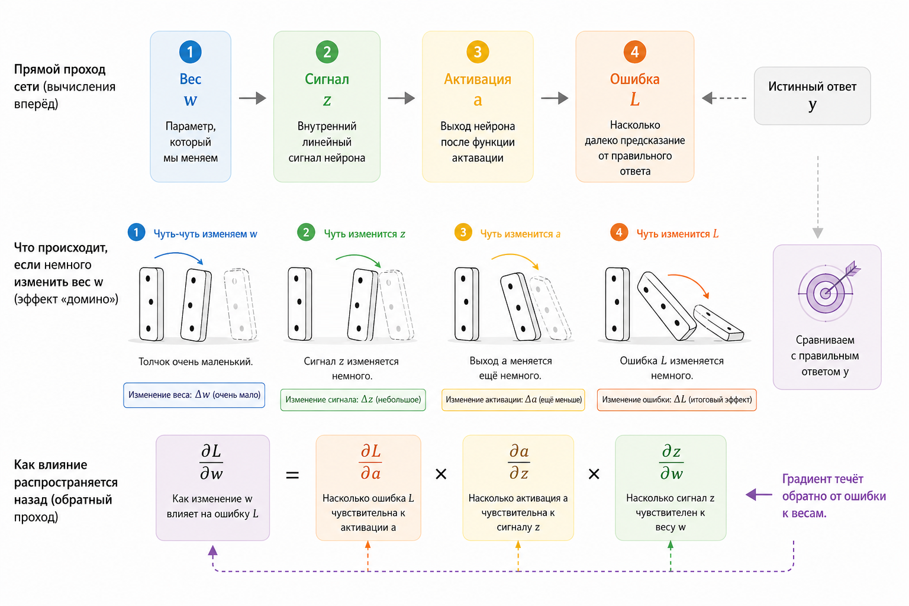
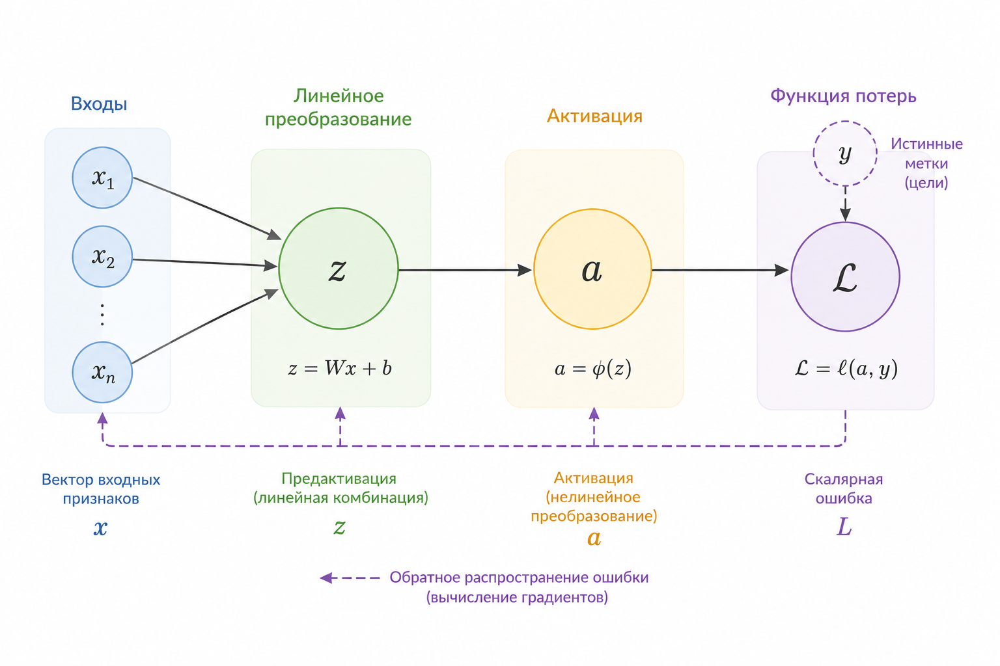
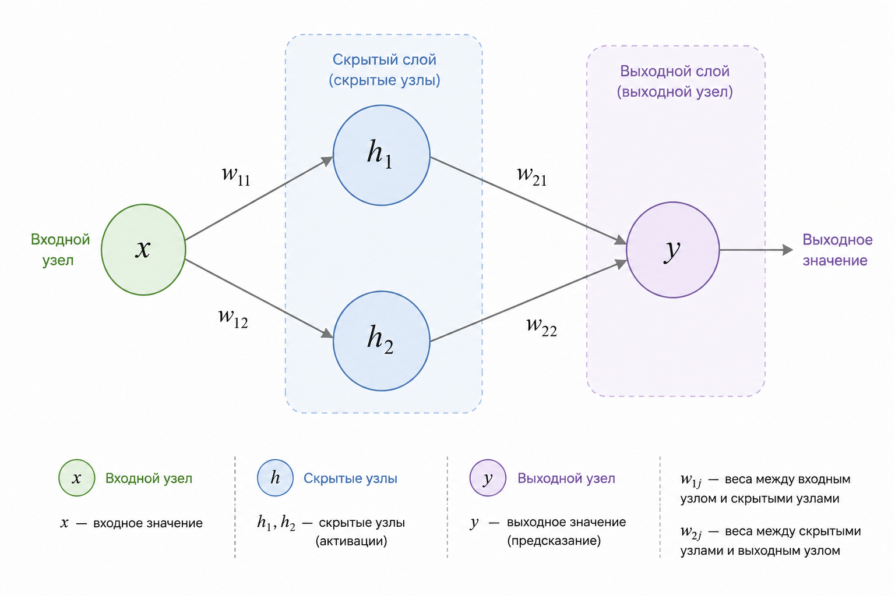
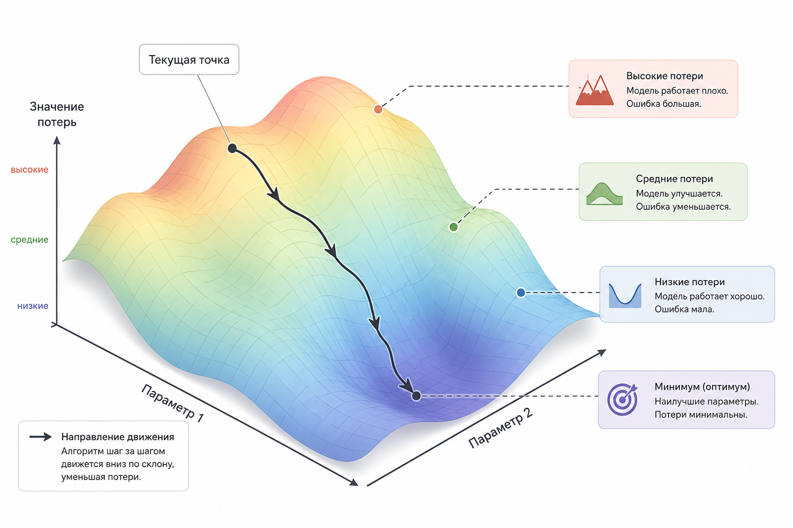

# 6.2 Backpropagation – почему он работает

Если вы дошли до этой главы, значит уже понимаете две ключевые идеи: перцептрон считает линейную комбинацию признаков, а нейросеть – это композиция таких комбинаций плюс добавление нелинейности.

Теперь главный вопрос: как сеть учится?

Почему вообще возможно подобрать тысячи и миллионы весов так, чтобы сеть начинала распознавать спам, лица или фишинговые письма?

Ответ – алгоритм [backpropagation](../../vvedenie/glossarii.md#backpropagation-obratnoe-rasprostranenie-oshibki), который позволяет эффективно вычислить, как каждый вес влияет на итоговую ошибку.

Его мы и рассмотрим в этой главе. Но без магии, без ужаса из учебников и без объяснений на десятки страниц.

### Интуиция: сеть как система труб

Представьте сеть как систему труб:&#x20;

```
вход → слой 1 → слой 2 → выход → ошибка
```

Вода течёт вперёд. Это [forward pass](../../vvedenie/glossarii.md#forward-pass-pryamoi-prokhod) (прямой проход).

На выходе мы сравниваем результат с правильным ответом и получаем ошибку. А теперь вопрос: если ошибка равна 0.3 – какой именно вес виноват?

Чтобы ответить на этот вопрос, давай поразмышляем. Представьте, что автомобиль проехал дальше, чем нужно.

Что стало причиной?

Не сами колёса и не пройденное расстояние. Причина – водитель сильнее нажал на педаль газа.

Но влияние произошло не напрямую:

* педаль газа изменила мощность двигателя
* двигатель изменил скорость
* скорость изменила пройденное расстояние
* расстояние определило величину ошибки

Чтобы определить, насколько виновата педаль газа, недостаточно посмотреть только на скорость автомобиля. Нужно проследить всю цепочку событий и понять, как каждое действие повлияло на итоговый результат. Backpropagation делает то же самое: он шаг за шагом проходит по нейронной сети в обратном направлении, определяя, какой вклад каждый вес внёс в конечную ошибку.

Именно поэтому backpropagation часто называют методом распределения ответственности: он позволяет понять, какие параметры сети ошиблись сильнее и требуют более существенной корректировки.

### Минимальная математика, без боли

Начнём с одного нейрона.

$$
z = w x + b
$$

Активация:

$$
a = f(z)
$$

Пусть ошибка:

$$
L = (a - y)^2
$$

Нам нужно понять:

$$
\frac{\partial L}{\partial w}
$$

То есть – как изменение веса влияет на ошибку. Если мы узнаем это, то сможем понять, в какую сторону нужно изменить вес, чтобы ошибка стала меньше. Именно на этот вопрос и отвечает производная.

#### Ключевая идея

Ошибка зависит от:

* активации
* активация зависит от $$z$$
* $$z$$ зависит от $$w$$

Это цепочка зависимостей.

<figure><figcaption><p>Рис. 6.2-1. Как небольшое изменение веса распространяется через сеть</p></figcaption></figure>

Небольшое изменение веса не влияет на итоговую ошибку напрямую. Сначала оно немного изменяет взвешенную сумму на входе нейрона, затем немного изменяет внутренний сигнал, после чего – выход нейрона, далее это изменение распространяется через следующие слои сети и лишь в конце отражается на значении функции потерь.

Чтобы вычислить влияние веса на итоговую ошибку, нужно проследить всю эту цепочку изменений. Именно здесь в действие вступает цепное правило (chain rule) – математический инструмент, который позволяет последовательно связать влияние каждого промежуточного изменения и определить вклад каждого веса в конечную ошибку.

### Цепное правило – человеческое объяснение

Чтобы узнать, насколько сильно изменение веса скажется на ошибке, нужно последовательно учесть влияние на каждом шаге этой цепочки. Именно поэтому в цепном правиле производные перемножаются.

Если:

$$
\begin{aligned}
L &= L(a) \\
a &= f(z) \\
z &= wx
\end{aligned}
$$

То:

$$
\frac{dL}{dw} = \frac{dL}{da} \cdot \frac{da}{dz} \cdot \frac{dz}{dw}
$$

В этом и состоит всё цепное правило.

Можно читать эту формулу справа налево. Сначала спрашиваем: насколько изменение веса влияет на $$z$$? Затем – насколько изменение $$z$$ влияет на активацию? И наконец – насколько изменение активации влияет на ошибку? Перемножая эти три влияния, мы получаем общий эффект изменения веса на итоговую ошибку.

Это просто правило:&#x20;

> если что-то зависит через цепочку, то производные перемножаются.

Почему именно произведение? Потому что каждый этап передаёт дальше лишь часть своего влияния. Общий эффект получается как последовательное прохождение этого влияния через всю цепочку, поэтому локальные коэффициенты влияния перемножаются.

### Почему это работает интуитивно

Представьте:

* $$L$$ - показывает, насколько нам плохо
* $$a$$ - говорит, что предсказала сеть
* $$z$$ - внутренний сигнал нейрона
* $$w$$ - ручка регулировки

Мы считаем:

1. Насколько ошибка чувствительна к выходу ( $$\frac{dL}{da}$$ )
2. Насколько выход чувствителен к внутреннему сигналу ( $$\frac{da}{dz}$$ )
3. Насколько сигнал зависит от веса ( $$\frac{dz}{dw}$$ )

И перемножаем.

Так мы шаг за шагом прослеживаем влияние каждого веса на итоговую ошибку.

Именно поэтому backpropagation иногда называют распространением ошибки назад: мы постепенно определяем, какую долю этой ошибки "создал" каждый параметр сети.

Чтобы формально описать эту цепочку зависимостей, удобно представить вычисления в виде вычислительного графа. В нём каждая операция становится отдельным узлом, а стрелки показывают, как одно значение зависит от другого.

<div align="left"><figure><figcaption><p>Рис. 6.2-2 Вычислительный граф</p></figcaption></figure></div>

В таком графе каждый узел представляет результат промежуточного вычисления, а каждое ребро показывает, как одна величина зависит от другой.

Во время backpropagation градиент распространяется по этому графу в обратном направлении – от функции потерь к исходным весам сети. На каждом шаге с помощью цепного правила вычисляется вклад текущей операции в общую производную.

Благодаря такому подходу не нужно заново выводить производную для каждого веса. Достаточно один раз построить вычислительный граф и последовательно пройти по нему в обратном направлении, вычисляя производные шаг за шагом.

### Числовой пример

Теперь, когда мы познакомились с основными формулами, разберём простой числовой пример и шаг за шагом проследим, как вычисляется градиент для одного веса нейрона.

<details>

<summary><strong>Подробное объяснение числового примера</strong></summary>

Пусть у нас есть один нейрон со следующими параметрами:

```
Вход:              x = 2
Вес:               w = 0.5
Смещение:          b = 0
Функция активации: sigmoid
Правильный ответ:  y = 1
```

**Шаг 1. Прямой проход (Forward Pass)**

Сначала вычисляем взвешенную сумму: $$z = x \cdot w + b$$

Подставляем значения: $$z = 2 \times 0.5 + 0 = 1$$

Теперь применяем сигмоиду: $$a = \sigma(z)=\frac{1}{1+e^{-z}}$$

Подставляем $$(z=1)$$: $$a=\frac{1}{1+e^{-1}} \approx0.731$$

Это предсказание нейронной сети.

**Шаг 2. Вычисляем ошибку**

Используем квадратичную функцию потерь:

$$L=(a-y)^2$$

Подставляем значения:

$$L=(0.731-1)^2 =(-0.269)^2 =0.0724$$

Ошибка сети равна **0.0724**.

**Теперь начинается Backpropagation**

Наша цель – понять, как изменить вес ($$w$$), чтобы ошибка стала меньше.

Вес влияет на ошибку не напрямую.

Сначала меняется:

```
 w
 ↓
z = xw+b
 ↓
a = sigmoid(z)
 ↓
L = (a-y)²
```

Поэтому вычисляем производную шаг за шагом.

**Шаг 3. Производная ошибки по выходу нейрона**

Вычисляем $$\frac{\partial L}{\partial a}$$

Функция ошибки: $$L=(a-y)^2$$

Производная квадрата:  $$\frac{\partial L}{\partial a} = 2(a-y)$$

Подставляем числа:  $$2(0.731-1) =2(-0.269) =-0.538$$&#x20;

Что означает это число?

Если немного увеличить выход нейрона ($$a$$), ошибка начнет уменьшаться.

**Шаг 4. Производная сигмоиды**

Теперь нужно понять, как изменение внутреннего значения (z) изменяет выход нейрона.

Вычисляем $$\frac{\partial a}{\partial z}$$

Для сигмоиды есть готовая формула: $$\frac{\partial a}{\partial z} = a(1-a)$$

Подставляем значение выхода нейрона: $$0.731(1-0.731) = 0.731\times0.269 = 0.1966$$

Это означает, что небольшое изменение ($$z$$) изменяет выход примерно в 0.197 раза.

**Шаг 5. Производная взвешенной суммы**

Теперь осталось понять, как изменение веса влияет на значение ($$z$$).

Напомним: $$z=xw+b$$

Берем производную по весу: $$\frac{\partial z}{\partial w} = x$$

Поскольку $$x=2$$,

то $$\frac{\partial z}{\partial w}=2$$

Это вполне логично: чем больше входной сигнал, тем сильнее изменение веса влияет на внутреннее значение нейрона.

**Шаг 6. Собираем всё вместе**

По цепному правилу: $$\frac{\partial L}{\partial w}  = \frac{\partial L}{\partial a} \cdot \frac{\partial a}{\partial z} \cdot \frac{\partial z}{\partial w}$$

Подставляем найденные значения: $$(-0.538) \times 0.1966 \times 2$$

Сначала: $$-0.538 \times 0.1966 = -0.1058$$

Теперь умножаем на 2: $$-0.1058 \times 2 = -0.2116$$

Округляем: $$\boxed{\frac{\partial L}{\partial w}\approx-0.212}$$

**Что означает полученный результат?**

Градиент оказался отрицательным: $$\frac{\partial L}{\partial w}\approx-0.212$$

Это говорит о том, что **увеличение веса уменьшит ошибку**.

Например, при скорости обучения ($$\eta=0.1$$): $$w_{\text{новый}} = w-\eta\frac{\partial L}{\partial w}$$

Подставляем числа: $$w_{\text{новый}} = 0.5-0.1(-0.212) = 0.5+0.0212 = 0.5212$$

Вес немного увеличился, а значит, при следующем прямом проходе выход нейрона станет ближе к правильному ответу ($$y=1$$), и ошибка уменьшится.

Так работает один шаг обучения нейронной сети.

</details>

Если вы внимательно разобрали этот числовой пример, то могли заметить, что для одного нейрона вычисление градиента не представляет особой сложности.&#x20;

Может показаться, что для глубокой нейронной сети подобная задача станет практически невыполнимой. Однако это не так. Независимо от того, содержит сеть один нейрон или миллионы параметров, backpropagation использует один и тот же механизм – цепное правило. Единственное отличие заключается в том, что цепочка зависимостей становится значительно длиннее, а вычислительный граф – гораздо больше.

### Теперь несколько слоёв

Пусть есть:

$$
\begin{aligned}
x &\to h \to y \\
h &= f(w_1 x) \\
y &= g(w_2 h)
\end{aligned}
$$

Ошибка:

$$
L = (y - t)^2
$$

Теперь:

$$
\frac{dL}{dw_1} = \frac{dL}{dy} \cdot \frac{dy}{dh} \cdot \frac{dh}{dw_1}
$$

Для каждого веса строится своя цепочка зависимостей. На каждом её шаге вычисляется производная только одной конкретной операции относительно предыдущего значения – такую производную называют локальной. Затем все эти локальные производные последовательно перемножаются по цепному правилу.

В глубокой сети эта цепочка просто становится длиннее: теперь она проходит через множество нейронов, слоёв и функций активации. Но сам принцип не меняется – мы по-прежнему последовательно вычисляем локальные производные и объединяем их с помощью цепного правила.

Таким образом, backpropagation – это автоматическое применение цепного правила ко всему вычислительному графу нейронной сети.

Вместо того чтобы выводить производные вручную для каждого веса, алгоритм проходит по вычислительному графу от выхода ко входу и делает это автоматически.

<div align="left"><figure><figcaption><p>Рис. 6.2-3. Сеть из двух слоёв</p></figcaption></figure></div>

### Как это выглядит в чистом PHP

Минимальный пример одного нейрона.

Всё, что мы только что посчитали вручную, теперь перенесём в код. Обратите внимание: в программе нет никакой дополнительной логики – те же самые формулы просто записаны на языке PHP.

```php
function sigmoid($x) {
    return 1 / (1 + exp(-$x));
}

// σ'(z)=σ(z)(1−σ(z)), поэтому достаточно уже вычисленной активации
// поэтому повторно вычислять sigmoid(z) не требуется
function sigmoid_derivative($a) {
    return $a * (1 - $a);
}

// Данные и начальные параметры.
$x = 2;          // вход
$w = 0.5;        // вес
$y = 1;          // ожидаемый результат
$lr = 0.1;

// 1. Forward (прямой проход)
$z = $w * $x;
$a = sigmoid($z);
$loss = pow($a - $y, 2);

// 2. Backward (обратный проход)
// По правилу цепочки:
// dL/dw = dL/da × da/dz × dz/dw
$dL_da = 2 * ($a - $y);
$da_dz = sigmoid_derivative($a);
$dz_dw = $x;

$gradient = $dL_da * $da_dz * $dz_dw;

// 3. Обновление веса методом градиентного спуска.
$w = $w - $lr * $gradient;

echo "Loss: " . $loss . "\n";
echo "Gradient: " . $gradient . "\n";
echo "New weight: " . $w;
```

Это и есть backpropagation – всего в чуть более десяти строках PHP.

Большинство библиотек машинного обучения делает ровно то же самое, только автоматически и сразу для миллионов параметров.

### Что происходит в глубокой сети

В глубокой сети:

* на каждом слое вычисляем локальную производную
* объединяем её с градиентом следующего слоя
* передаём результат предыдущему слою

Это похоже на последовательный поиск причины ошибки. Каждый слой получает информацию о том, насколько ошибка зависит от его выхода, вычисляет свой вклад и передаёт эту информацию предыдущему слою. Так шаг за шагом влияние ошибки распространяется от выхода сети к её входу.

Ошибка с выхода "затухает" или "взрывается" в зависимости от производных.

Отсюда:

* проблема затухающего градиента
* проблема взрывающегося градиента

И поэтому:

* ReLU лучше сигмоиды в глубоких сетях
* нужна нормализация
* нужны хорошие инициализации

Мы рассмотрели градиент как обычное число. Теперь давайте посмотрим на него с другой точки зрения – как на направление движения в пространстве всех параметров модели.

### Почему это не магия

Всё сводится к трём фактам:

1. Сеть – композиция функций
2. Производная композиции – произведение производных
3. Мы можем считать их эффективно, проходя назад

Backpropagation сам по себе ничего не обучает. Его задача – вычислить [градиенты](../../vvedenie/glossarii.md#gradient) для всех параметров сети. Уже после этого алгоритм оптимизации (например, градиентный спуск) использует эти градиенты, чтобы изменить веса и уменьшить ошибку.

### Геометрическая интерпретация

Градиент – это направление самого быстрого роста ошибки.&#x20;

Поэтому при обучении мы движемся в противоположную сторону – против градиента, постепенно уменьшая ошибку.

Если представить поверхность ошибки:

<div align="left"><figure><figcaption><p>Рис. 6.2-4. Поверхность функции ошибки</p></figcaption></figure></div>

Backpropagation вычисляет этот градиент, после чего алгоритм оптимизации делает шаг в противоположном направлении чтобы уменьшить ошибку.

### Почему это вообще удивительно

Фактически:

* у нас могут быть миллионы параметров
* каждый параметр влияет на выход через длинную цепочку
* но мы можем посчитать всё за время, линейное по числу связей

Без backpropagation обучение глубокой сети было бы невозможным.

### Связь с практикой (B2B security, PHP)

Если вы работаете с:

* детекцией фишинга
* классификацией email
* поведением пользователя

То любая нейросеть в основе использует именно это.

Даже если вы применяете готовую библиотеку, например RubixML, внутри происходит именно это распространение градиента.

Понимание backpropagation даёт:

* уверенность
* способность проводить отладку
* понимание, почему модель "застряла"

### Главное, что нужно запомнить

Backpropagation – это:

* не магия
* не искусственный интеллект
* не нейробиология

Это просто: цепное правило, применённое к графу вычислений.

### Если хотите понять окончательно

Возьмите:

* 2 входа
* 1 скрытый слой
* 1 выход
* квадратичную ошибку

И распишите производные руками.

После этого вы перестанете бояться формул.

### Заключение

Backpropagation стал одним из ключевых алгоритмов, сделавших возможным обучение глубоких нейронных сетей.

Он прост:

* идём вперёд
* считаем ошибку
* идём назад
* распределяем ответственность
* обновляем веса

Всё остальное – это развитие этой идеи и способы сделать обучение быстрее, стабильнее и эффективнее.

И самое важное: вы уже способны реализовать это в PHP и понимаете, что backpropagation – это не чёрный ящик. Это всего лишь последовательное применение цепного правила к вычислительному графу сети.

А значит, понимаете не только как обучается современный AI, но и почему это обучение вообще возможно.
