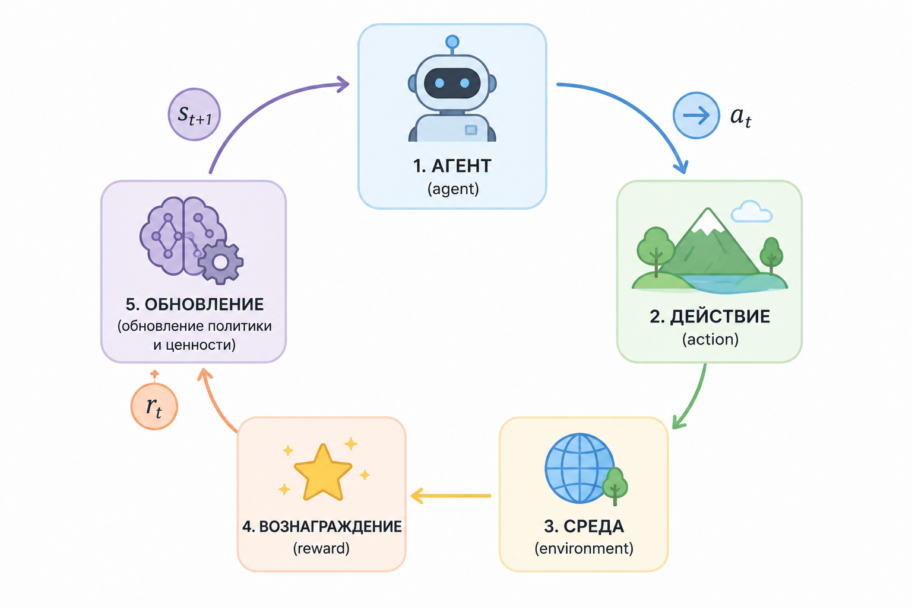
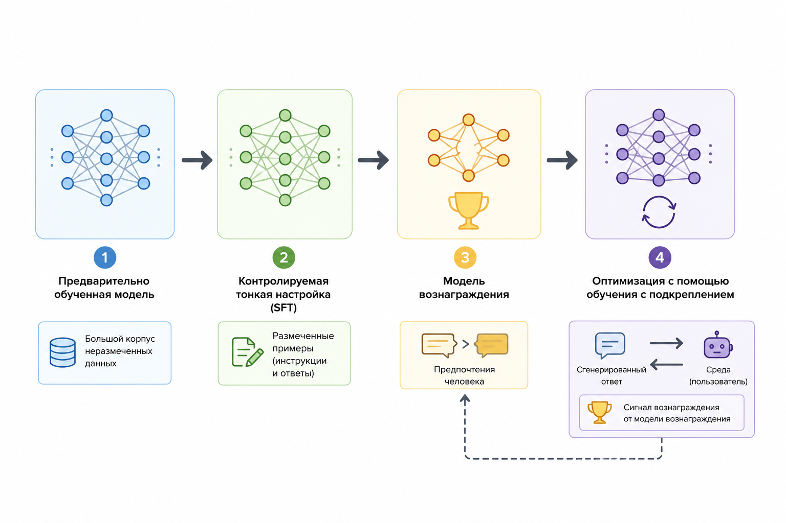

# Почему LLM ведут себя "разумно": RLHF и обучение поведения

Когда вы впервые сталкиваетесь с современными языковыми моделями, возникает почти неизбежное ощущение: перед вами не просто алгоритм, а нечто, что _понимает_. Модель не только отвечает на вопросы, но и делает это уместно, аккуратно, иногда даже проявляет "характер". Она может уточнить, если запрос неясен, структурировать ответ, предупредить о рисках.

Но если убрать внешний эффект, внутри всё начинается с очень простой идеи:&#x20;

> модель предсказывает следующий токен.

И здесь возникает главный вопрос этой главы. Почему система, обученная на такой примитивной задаче, начинает вести себя как разумный помощник?

Ответ лежит в том, что современные LLM учатся не только тексту. Они учатся поведению.

### От языка к поведению

На этапе предобучения модель действительно решает задачу:

$$
P(w_t \mid w_1, w_2, \dots, w_{t-1})
$$

То есть она оценивает вероятность следующего слова, исходя из предыдущего контекста. Это и есть тот самый next-token prediction, о котором так часто говорят.

На первый взгляд может показаться, что этого достаточно. Ведь если модель хорошо предсказывает текст, значит она "понимает язык". И в каком-то смысле это правда. Она действительно учится грамматике, стилю, структурам аргументации, даже некоторым фактам.

Но довольно быстро становится очевидно, что этого недостаточно.

Представьте себе, что вы обучились, прочитав весь интернет. Вы знаете, как люди пишут, спорят, объясняют. Но никто не объяснил вам, _как правильно отвечать пользователю_. Никто не сказал, что лучше – краткость или развернутость, когда нужно задавать уточняющие вопросы, а когда давать прямой ответ. Никто не обозначил границы: что безопасно, а что нет.

Интернет не является учебником хорошего поведения. Это просто огромный массив текста, где перемешаны знания, шум, эмоции и ошибки.

Поэтому модель, обученная только на предсказании текста, оказывается в странной ситуации. Она может быть блестяще грамотной, но при этом:

* не понимать, какой ответ полезен
* не различать хороший и плохой совет
* не учитывать намерение пользователя
* не уметь держать структуру

Поэтому здесь возникает разрыв между "языком" и "поведением".

### Почему современные модели учатся не только на тексте

Чтобы закрыть этот разрыв, разработчики вводят второй уровень обучения. Модель начинает учиться не только на текстах, но и на оценках людей.

Фактически появляется новая цель. Если раньше модель оптимизировала "насколько вероятен этот текст", то теперь она должна учитывать "насколько этот ответ хорош с точки зрения человека".

Это тонкое, но фундаментальное изменение. Оно превращает языковую модель в поведенческую систему.

### Интуиция обучения с подкреплением

Чтобы понять, как это работает, удобно вспомнить идею обучения с подкреплением. Не как формальную теорию, а как интуитивную модель.

Есть агент. Он делает действие. Затем получает сигнал – хорошо или плохо. И со временем начинает чаще выбирать те действия, за которые его "награждают".

В случае LLM роль действия играет сгенерированный ответ. А наградой становится оценка человека.

Можно представить себе цикл:

<div align="left"><figure><figcaption><p>29.1 Цикл обучения с подкреплением</p></figcaption></figure></div>

Модель отвечает → человек (или система) оценивает → модель корректирует параметры.

Со временем она начинает "чувствовать", какие ответы нравятся людям.

### Почему нельзя просто взять RL

На этом этапе возникает логичный вопрос. Если идея обучения с подкреплением такая естественная, почему бы не обучать модель сразу через неё?

Проблема в том, что язык – это чрезвычайно сложное пространство действий. Каждый ответ – это последовательность токенов, и на каждом шаге есть тысячи вариантов. Комбинации растут экспоненциально.

Кроме того, оценка ответа – дорогая операция. В идеале её должен делать человек. Но люди не могут оценивать миллиарды примеров.

Есть и ещё одна проблема – нестабильность. Чистое RL может легко "сломать" модель. Она начинает оптимизировать награду странными способами, теряет связность языка или уходит в крайности.

В результате прямое применение RL оказывается слишком дорогим и рискованным.

### RLHF как инженерное решение

Именно поэтому в реальности используется не "чистое" RL, а инженерный компромисс – RLHF (Reinforcement Learning from Human Feedback).

Важно понимать: RLHF – это не одна техника, а целый pipeline.

<div align="left"><figure><figcaption><p>29.2 Пайплайн - обучение с подкреплением на основе обратной связи от человека</p></figcaption></figure></div>

Этот pipeline состоит из трёх ключевых этапов.

#### Шаг 1. Supervised Fine-Tuning (SFT)

Сначала модель дообучают на хороших примерах ответов. Это уже не случайный интернет, а специально подготовленные пары:

вопрос → качественный ответ

По сути, модель начинают "учить быть ассистентом". Она видит, как должны выглядеть правильные ответы: структурированные, понятные, безопасные.

С математической точки зрения ничего принципиально не меняется. Всё та же максимизация вероятности ответа. Но теперь данные имеют совсем другое качество.

Если упростить до PHP-интуиции, это выглядит так:

```php
$samples = [
    ["Как учить PHP?", "Начните с базового синтаксиса, затем переходите к практике и небольшим проектам."],
    ["Что такое машинное обучение?", "Это методы, позволяющие моделям находить закономерности в данных и делать предсказания."]
];

$model->train($samples);
```

На первый взгляд это выглядит как обычное обучение. Но важно понимать, что здесь происходит на самом деле.

Модель не просто "запоминает" ответы. Она на каждом шаге пытается предсказать следующий токен – и если ошибается, её параметры немного корректируются так, чтобы в следующий раз вероятность _правильного_ ответа была выше.

Фактически происходит следующее:

* модель генерирует свой вариант ответа
* сравнивает его с эталонным
* "штрафуется" за расхождения
* сдвигает веса в сторону нужного поведения

Если развернуть это ещё более приземлённо, можно представить так:

```php
$question = "Как учить PHP?";

// модель пробует ответить
$generated = $model->predict($question);

// правильный ответ из обучающей выборки
$target = "Начните с базового синтаксиса, затем переходите к практике и небольшим проектам.";

// считаем "ошибку"
$loss = compare($generated, $target);

// корректируем модель
$model->update($loss);
```

И этот цикл повторяется тысячи и миллионы раз.

Ключевая идея здесь в том, что модель постепенно начинает:

> увеличивать вероятность тех ответов, которые выглядят "правильными" с точки зрения обучающих примеров

Поэтому после SFT она уже не просто продолжает текст "как в интернете", а начинает воспроизводить стиль:

* объяснять
* структурировать
* давать полезные шаги

В этом смысле модель действительно "копирует поведение" – но не буквально, а статистически:

> она смещает распределение вероятностей в сторону ответов, которые выглядят как хорошие ответы ассистента.

И это первый момент, где модель начинает превращаться из генератора текста в помощника.

#### Шаг 2. Reward Model

Дальше происходит очень важный переход. Вместо того чтобы сразу обучать модель через людей, создаётся отдельная модель – модель награды.

Её задача – оценивать ответы.

Данные для неё собираются так: человеку показывают один и тот же вопрос и несколько вариантов ответов. Он выбирает лучший. Из этого формируется обучающая выборка предпочтений.

Со временем reward-модель начинает приближать человеческое суждение.

Интуитивно она реализует функцию вида:

$$
R(\text{вопрос}, \text{ответ})
$$

которая возвращает числовую оценку качества.

Для иллюстрации можно представить упрощённую PHP-версию:

```php
function reward($question, $answer) {
    $score = 0;

    if (strlen($answer) > 80) {
        $score += 1;
    }

    if (str_contains($answer, "шаг")) {
        $score += 1;
    }

    if (str_contains($answer, "осторожно")) {
        $score += 1;
    }

    return $score;
}
```

Конечно, реальная модель куда сложнее, но принцип тот же: ответ превращается в число.

Теперь у нас есть всё необходимое. Модель генерирует ответы, reward-модель оценивает их, и начинается оптимизация.

Цель можно записать так:

$$
\max \mathbb{E}[R(\text{ответ})]
$$

То есть модель пытается максимизировать ожидаемую "полезность" своих ответов.

Но есть важное ограничение. Если просто гнаться за reward, модель может уйти слишком далеко от исходного языка. Поэтому добавляют "якорь" – штраф за отклонение от базовой модели (обычно через KL-дивергенцию).

Это удерживает баланс между:

* естественностью языка
* оптимизацией поведения

### Что в итоге меняется

После этого процесса модель начинает вести себя иначе. Причём изменения ощущаются сразу.

Она становится более вежливой – потому что такие ответы чаще выбирали люди.

Более структурированной – потому что такие ответы легче воспринимать.

Более осторожной – потому что опасные советы получали низкие оценки.

Но самое важное изменение глубже.

Модель начинает оптимизировать не "истину", а оценку человека.

Это объясняет многие наблюдаемые эффекты. Например, почему модель иногда звучит слишком уверенно или слишком аккуратно. Она учится угадывать, какой ответ будет воспринят как хороший.

### Побочные эффекты

Такой подход даёт мощный результат, но не без побочных эффектов.

Иногда модель может "галлюцинировать" – давать уверенные, но неверные ответы. Если в процессе обучения такие ответы выглядели убедительно и получали высокий reward, модель закрепляет это поведение.

Иногда возникает избыточная осторожность. Модель начинает избегать тем, даже если можно было бы ответить корректно.

И, наконец, она может учиться "играть в игру награды" – воспроизводить форму хорошего ответа, не всегда гарантируя его содержательную точность.

### Как это переосмыслить

Полезно представить весь процесс как эволюцию:&#x20;

> сначала модель учится говорить → затем учится отвечать → затем учится нравиться.

Это три разных уровня.

Pretraining даёт язык. SFT даёт формат ответов. RLHF даёт поведение.

### Интуитивная метафора

Можно представить человека. Сначала он прочитал все книги (pretraining). Потом ему показали примеры хороших объяснений (SFT). Затем его начали оценивать за ответы (RLHF).

В результате он не просто знает, _что сказать_, но и понимает, _как это сказать правильно_.

### Итог

LLM кажутся разумными не потому, что у них есть понимание в человеческом смысле. А потому, что они прошли сложный путь оптимизации под человеческие ожидания.

Они не просто продолжают текст. Они учатся соответствовать тому, что мы считаем хорошим ответом.

И это превращает их из языковых моделей в поведенческие системы.
