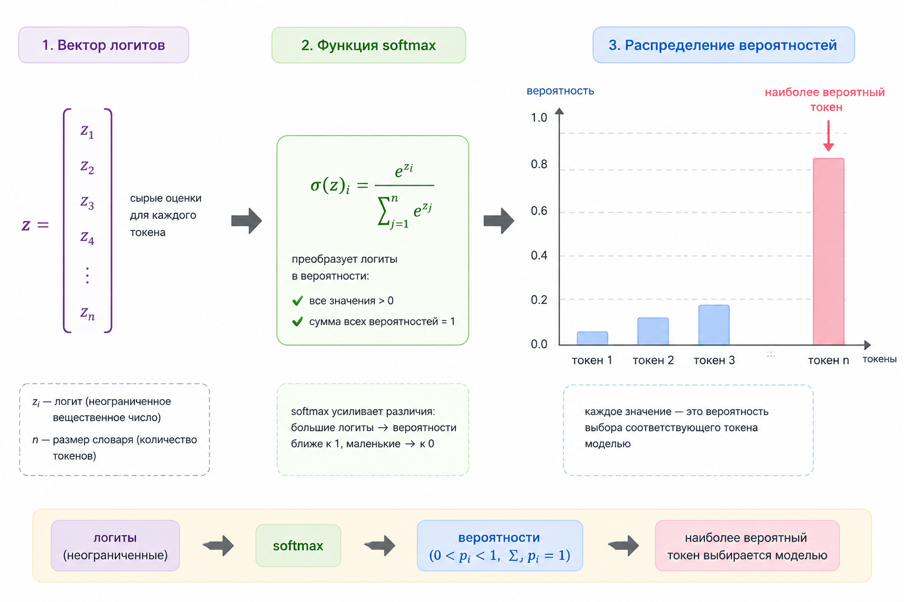
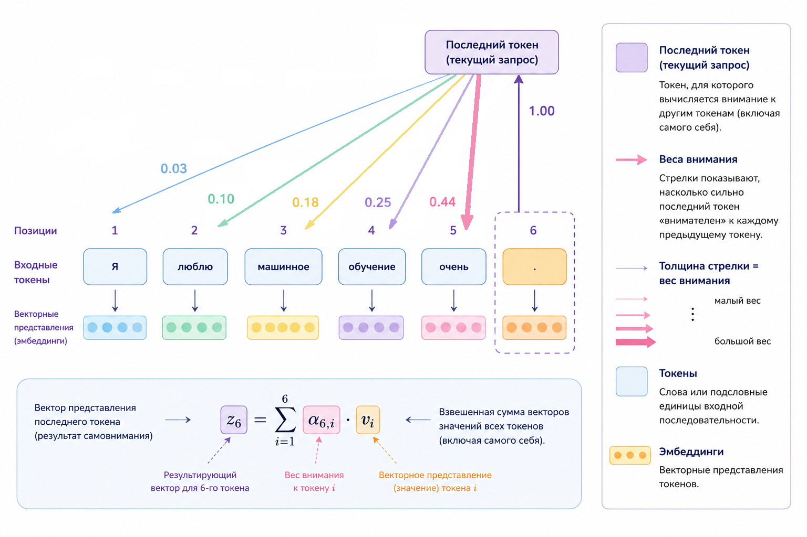

# Почему LLM – это модели next-token prediction

Несмотря на весь хайп, интерфейсы, "разумность" и разговорный стиль и прочее, о чём вы можете прочитать в Интернете, большие языковые модели вроде OpenAI GPT-4 делают на самом деле одну предельно простую вещь:

> Они предсказывают следующий токен.

И всё.

Ни "понимания", ни "мышления" в человеческом смысле в формуле нет. Есть последовательность символов – и задача продолжить её статистически наиболее правдоподобным образом.

Но именно эта простая формулировка, доведённая до гигантских масштабов данных и параметров, и создаёт ту магию, которая сводит с ума любого, кто сталкивался с работой  LLM.

### Формальная постановка задачи

Пусть у нас есть последовательность токенов:

$$
x_1, x_2, x_3, ..., x_{t-1}
$$

Модель должна оценить вероятность следующего токена:

$$
P(x_t \mid x_1, x_2, ..., x_{t-1})
$$

Это и есть задача next-token prediction.

Если последовательность – это текст:

```
"PHP is a popular programming"
```

Модель должна оценить вероятности для:

```
language
tool
banana
framework
river
...
```

И выбрать (или сэмплировать) наиболее вероятный вариант.

### Разложение вероятности всей последовательности

LLM обучается максимизировать вероятность всей последовательности текста:

$$
P(x_1, x_2, ..., x_n)
$$

По правилу цепочки вероятностей:

$$
P(x_1, ..., x_n) = \prod_{t=1}^{n} P(x_t \mid x_1, ..., x_{t-1})
$$

То есть вся "магия текста" – это всего лишь произведение вероятностей каждого следующего токена. Приношу свои извинения, если ненароком разрушил ваши иллюзии относительно того, как работают LLM.

Но вот в чём парадокс: объяснение механизма не уничтожает феномен. Музыка – это колебания воздуха. Картина — пигмент на холсте. Любовь — биохимия. И всё же ни одно из этих описаний не делает переживание менее реальным для того, кто его испытывает.

Так что магия никуда не исчезает. Она просто меняет адрес: не внутри модели, а в столкновении модели и человека. Смысл возникает не в матрицах – а в вашем восприятии.

И если что-то и разрушилось, то, возможно, только иллюзия мистики. А восхищение сложностью – осталось.

### Что такое токен?

Важно понимать: модель работает не со словами, а с токенами.

Токен может быть:

* словом
* частью слова
* символом
* знаком пунктуации

Например:

```
"unbelievable"
```

может разбиться на:

```
["un", "believ", "able"]
```

Модель предсказывает именно следующий токен, а не слово целиком.

### Архитектура: где появляется вероятность?

Внутри LLM (обычно это Transformer) происходит следующее:

1. Токены → эмбеддинги
2. Несколько слоёв self-attention
3. На выходе – вектор размерности `d_model`
4. Линейная проекция в размер словаря
5. Softmax → вероятности

Схема:

```
[токены]
     ↓
[Embedding]
     ↓
[Transformer blocks]
     ↓
[Linear layer]
     ↓
[Softmax]
     ↓
P(next_token)
```

### Линейная проекция в словарь

Пусть размер скрытого состояния:

$$
h_t \in \mathbb{R}^{d}
$$

Размер словаря:

$$
|V| = 50\,000
$$

Последний слой – это просто линейная операция:

$$
z = W h_t + b
$$

где:

* $$W \in \mathbb{R}^{|V| \times d}$$&#x20;
* $$z \in \mathbb{R}^{|V|}$$

Каждый элемент $$z_i$$ – это logit для $$i$$-го токена.

### Softmax – превращаем logits в вероятности

Softmax определён как:

$$
P_i = \frac{e^{z_i}}{\sum_{j=1}^{|V|} e^{z_j}}
$$

Это даёт распределение вероятностей по словарю.

#### Почему экспонента?

Она:

* усиливает разницу между значениями
* гарантирует положительность
* делает нормировку удобной

<div align="left"><figure><figcaption><p>28.1 Распределение вероятностей после softmax</p></figcaption></figure></div>

### Температура и контроль креативности

Перед softmax можно ввести температуру $$T$$:

$$
P_i = \frac{e^{z_i / T}}{\sum_j e^{z_j / T}}
$$

* $$T < 1$$ – распределение становится более "жёстким"
* $$T > 1$$ – более равномерным

Это напрямую влияет на креативность генерации.

### Обучение – что именно минимизируется?

Используется cross-entropy loss:

$$
L = - \log P(x_t^{true})
$$

Если правильный токен имеет высокую вероятность – loss маленький.

Вся тренировка – это:

> Максимизировать вероятность правильного следующего токена.

Никаких "ответов", "смыслов" или "истины" в формуле нет.

### Контекст – откуда берётся "понимание"?

Модель не хранит знания в явном виде.

Она видит:

$$
x_1, ..., x_{t-1}
$$

Self-attention позволяет каждому токену учитывать все предыдущие.

Если раньше было:

```
The capital of France is
```

то токен _France_ влияет на скрытое состояние последнего токена через attention.

Контекст – это просто информация, закодированная в векторе $$h_t$$.

<div align="left"><figure><figcaption><p>28.2 Схема внимания на предыдущие токены</p></figcaption></figure></div>

### Почему это работает так хорошо?

Потому что язык статистически структурирован.

Если обучать модель на миллиардах текстов, она:

* усваивает грамматику как статистический паттерн
* усваивает факты как устойчивые последовательности
* усваивает стиль как распределение вероятностей

То, что выглядит как "понимание", – это устойчивые вероятностные закономерности.

### Минимальный пример next-token модели на PHP

Сделаем игрушечную модель на основе n-грамм.

#### Шаг 1 – подсчёт переходов

```php
$text = "php is good php is fast php is popular";

$tokens = explode(" ", $text);

$transitions = [];

for ($i = 0; $i < count($tokens) - 1; $i++) {
    $current = $tokens[$i];
    $next = $tokens[$i + 1];

    if (!isset($transitions[$current])) {
        $transitions[$current] = [];
    }

    if (!isset($transitions[$current][$next])) {
        $transitions[$current][$next] = 0;
    }

    $transitions[$current][$next]++;
}
```

#### Шаг 2 – превращаем в вероятности

```php
$probabilities = [];

foreach ($transitions as $token => $nextTokens) {
    $total = array_sum($nextTokens);

    foreach ($nextTokens as $next => $count) {
        $probabilities[$token][$next] = $count / $total;
    }
}
```

#### Шаг 3 – генерация

```php
function sampleNext($distribution) {
    $rand = mt_rand() / mt_getrandmax();
    $cumulative = 0;

    foreach ($distribution as $token => $prob) {
        $cumulative += $prob;
        if ($rand <= $cumulative) {
            return $token;
        }
    }
}

$current = "php";

for ($i = 0; $i < 10; $i++) {
    if (!isset($probabilities[$current])) break;

    $next = sampleNext($probabilities[$current]);
    echo $next . " ";
    $current = $next;
}
```

Это простейшая модель next-token prediction.

LLM делает то же самое, только:

* контекст не 1 слово, а тысячи токенов
* вместо таблицы – миллиарды параметров
* вместо частот – нейросетевые веса

### Важный философский вывод

LLM не "знает" ответ.

Она оценивает:

$$
P(token \mid context)
$$

Когда вы задаёте вопрос, модель:

1. Кодирует его в вектор
2. Предсказывает наиболее вероятное продолжение
3. Делает это снова и снова

Ответ – это последовательность наиболее вероятных токенов.

### Почему из next-token prediction возникает reasoning?

Потому что:

* логические цепочки – это тоже устойчивые текстовые паттерны
* доказательства, рассуждения и шаги решения встречаются в обучающих данных
* модель учится продолжать их

Она не "думает" – она продолжает текст, который _похож на рассуждение_.

И этого (о чудо!) оказывается достаточно, чтобы:

* писать код
* решать задачи
* объяснять теорию
* строить планы

### Связь с предыдущими главами

* Attention объясняет, как учитывается контекст
* Backpropagation объясняет, как настраиваются веса
* Перцептрон и линейные комбинации – основа logits

LLM – это просто огромная композиция знакомых нам математических блоков.

### Ключевая идея главы

> Большая языковая модель – это вероятностный механизм продолжения последовательности.

Всё остальное – масштаб, данные и архитектурные детали.

Если это глубоко понять, становится ясно:

* почему возникают галлюцинации
* почему важен контекст
* почему prompt engineering работает
* почему temperature меняет стиль
* почему fine-tuning меняет поведение

И становится понятно главное:

LLM – это не магия.

Это предсказание следующего токена, доведённое до экстремального масштаба.
