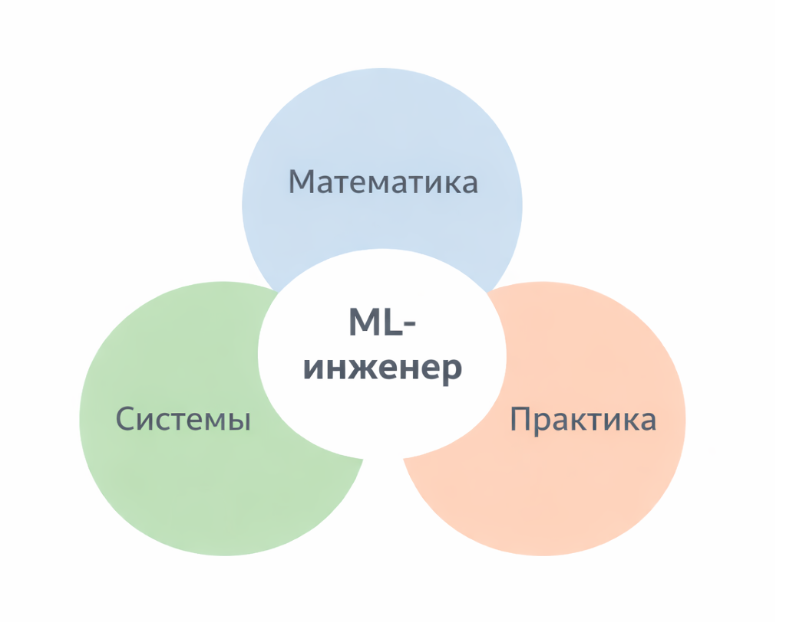

# Куда двигаться дальше

После того как вы прошли базовые главы – линейную и логистическую регрессию, метрики, эмбеддинги, NER, RAG, нейросети – возникает естественный вопрос: что дальше?

Учить больше математики?

Погружаться в архитектуру и продакшен?

Или просто продолжать делать проекты?

Правильный ответ – зависит от того, кем вы хотите стать. ML – это не одна профессия, а несколько траекторий.

В этой главе разберем три направления развития:

* углубление в математику
* развитие инженерных системных навыков
* расширение практического опыта

И главное – как понять, что именно вам нужно сейчас.

### Если углублять математику

Математика – это фундамент. Без нее можно работать, но с ней вы начинаете понимать, _почему_ все работает.

#### Что именно углублять

Если говорить практично, то не "всю высшую математику", а конкретные блоки:

Линейная алгебра:

* векторы и пространства
* матрицы и операции
* собственные значения и разложения

Без линейной алгебры невозможно по-настоящему понять эмбеддинги, матричную факторизацию и нейронные сети.

Теория вероятностей:

* условная вероятность
* [априорная и апостериорная вероятность](../vvedenie/glossarii.md#apriornaya-i-aposteriornaya-veroyatnost)
* [байесовское обновление](../vvedenie/glossarii.md#bayesian-updating-baiesovskoe-obnovlenie)
* распределения

Формула Байеса:

$$
P(A \mid B) = \frac{P(B \mid A)\, P(A)}{P(B)}
$$

Если вы интуитивно понимаете, как обновляется вероятность при поступлении новых данных – вы уже мыслите как ML-инженер.

Оптимизация:

* градиент
* частные производные
* функции потерь
* регуляризация

Например, при обучении логистической регрессии минимизируется log loss:

$$
L = -\frac{1}{N} \sum \left[ y \log(p) + (1 - y)\log(1 - p) \right]
$$

Понимание того, почему эта функция выпуклая и почему градиентный спуск сходится – дает уверенность.

#### Когда стоит идти в математику глубже

* если вам интересно, _почему_ модель ведет себя именно так
* если вы хотите работать с нестандартными алгоритмами
* если вы планируете заниматься исследованиями
* если хотите создавать свои методы, а не только применять чужие

Если же вы строите RAG-системы, настраиваете инференс и разворачиваете ONNX-модели, то глубокая математика может быть вторичной.

### Если углублять системную инженерию

Это путь ML-инженера продакшена.

Здесь главный вопрос не "как работает формула", а:&#x20;

* как модель обновляется
* как она масштабируется
* как контролируется drift
* как измеряется качество в реальном времени

#### Что изучать

Архитектура ML-систем:

* пайплайны
* feature store
* versioning моделей
* A/B тестирование

MLOps:

* CI/CD для моделей
* мониторинг
* retraining
* rollback

Инференс и оптимизация:

* батчевый vs онлайн-инференс
* квантизация
* ONNX
* ускорение на CPU / GPU

Если модель – это 5% системы, а инфраструктура – 95%, то именно здесь происходит настоящая инженерия.

#### Где это особенно важно

* e-commerce
* fintech
* SaaS
* news-агрегаторы
* рекомендательные системы

С учетом того, что вы уже строите архитектурные и прикладные кейсы (например, RAG для внутренней документации или оценку вероятного чека клиента), именно системный слой может дать максимальный рост.

### Если углублять практику

Практика – это самый быстрый способ роста.

Не чтение 300 страниц, а:

* взять датасет
* поставить задачу
* построить baseline
* улучшить
* задеплоить

#### Что дает практика

1. Вы начинаете видеть реальные ограничения данных
2. Учитесь выбирать метрики
3. Понимаете trade-offs
4. Осваиваете пайплайн от идеи до продакшена

**Например:**

Кейс: “Подпишется ли пользователь на рассылку?”

Вы можете:

* построить логистическую регрессию
* сравнить accuracy и log loss
* добавить регуляризацию
* внедрить A/B тест

И именно на практике станет ясно, что улучшение log loss на 0.02 может быть важнее роста accuracy на 1%.

### Три траектории развития

<div align="left"><figure><figcaption><p>32.1 Карта направлений развития</p></figcaption></figure></div>

Упрощенно можно выделить три роли:

#### 1. ML-исследователь

Фокус – математика и новые алгоритмы.

Инструменты – Python + PyTorch (как индустриальный стандарт исследований), статьи, оптимизация. PHP в этой роли используется редко.

Цель: новые алгоритмы.

#### 2. ML-инженер продакшена (в том числе на PHP)

Фокус – внедрение моделей в реальные системы.

Инструменты:

* пайплайны
* PHP
* REST / gRPC
* ONNX
* Docker
* внешние ML-сервисы
* RAG
* эмбеддинги
* inference-серверы
* мониторинг

Цель: стабильность и масштабируемость.

И это абсолютно полноценная траектория.

#### 3. Прикладной инженер / продуктовый ML

Фокус: практика

Инструменты: быстрые прототипы, A/B тесты

Цель: бизнес-результат

Ни одна из ролей не лучше другой. Они просто разные.

#### Важно понять архитектурную реальность

В большинстве современных систем архитектура выглядит так:

```
[Research / Training] → Python
[Inference / API / Business logic] → PHP
```

То есть:

Модель обучена в PyTorch → экспортирована в ONNX → инференс вызывается из PHP →\
результат используется в продукте.

Это нормальная инженерная схема.

**Почему в research доминирует Python**

Если открыть статьи на arXiv или репозитории state-of-the-art моделей, то почти все эксперименты публикуются на базе:

* PyTorch
* TensorFlow

Причины исторические и экосистемные:&#x20;

1\. Python – простой синтаксис → быстрее прототипирование \
2\. Огромное количество научных библиотек \
3\. Большое комьюнити исследователей \
4\. Стандарт де-факто для публикации reproducible research

Это не про "лучший язык". Это про инерцию экосистемы.

**Но означает ли это, что PHP не подходит?**

Нет. Просто роли разные.

Если говорить честно:

* PHP почти не используется для research
* PHP отлично подходит для интеграции, продакшена, бизнес-логики

И это две разные задачи.

**Ключевой момент**

Эта книга не про то, чтобы заменить Python.

Она про то, чтобы:

* понимать ML
* уметь интегрировать ML
* строить ML-системы на PHP

И если вы не планируете писать новые оптимизаторы или публиковать исследовательские статьи, вам Python может быть вообще не нужен.

### Как понять, что вам нужно сейчас

Задайте себе три вопроса.

1. Вам больше интересно доказательство формулы или то, что она работает?
2. Вас больше увлекает архитектурная схема или график функции потерь?
3. Вам важнее точность модели или скорость ее внедрения?

Ответы обычно очевидны.

### Ошибка, которую совершают многие

Они пытаются углублять все сразу.

В итоге:

* математика недоучена
* системное мышление поверхностное
* практики мало

Лучше выбрать доминирующее направление на 6–12 месяцев.

Например:

Год 1 – практика + продакшен

Год 2 – системная глубина

Год 3 – математика

Или наоборот.

### Минимальный план развития

Если вы работаете в PHP и строите ML-решения, разумная последовательность может быть такой:

Сначала:

* довести до автоматизма регрессию, классификацию, метрики
* реализовать 3–5 полноценных кейсов

Затем:

* построить полноценный ML-пайплайн
* внедрить мониторинг
* оптимизировать инференс

И только потом:

* глубже уйти в линейную алгебру
* разобрать градиентный спуск математически
* понять регуляризацию через призму оптимизации

### Главный принцип

ML – это инженерная дисциплина.

Даже если вы уходите в математику, конечная цель – работающая система.

Даже если вы делаете только практику, важно понимать базовые принципы вероятностей.

И даже если вы строите инфраструктуру, нужно понимать, что именно модель оптимизирует.

### Итог

Вопрос "что углублять" – это не вопрос правильности. Это вопрос стратегии.

Если коротко:

* Хотите создавать новые методы – идите в математику.
* Хотите строить масштабируемые системы – идите в архитектуру.
* Хотите быстро расти и давать бизнес-результат – делайте больше практики.

Лучший путь – тот, который вы выбираете осознанно.

И, возможно, самый зрелый этап развития – это когда вы начинаете видеть связь между формулой, кодом и продакшен-системой как единой целостной инженерной конструкцией.
